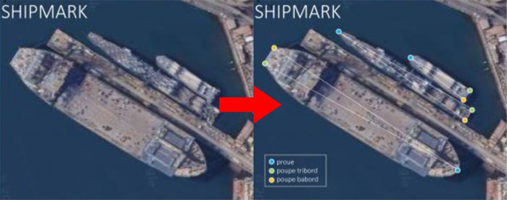
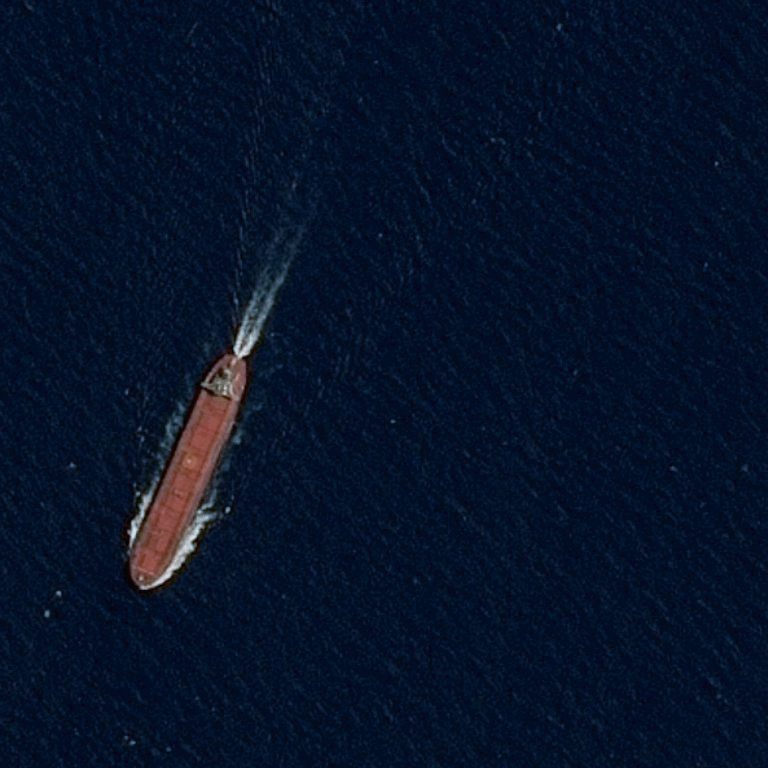
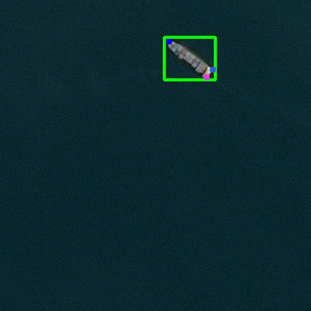
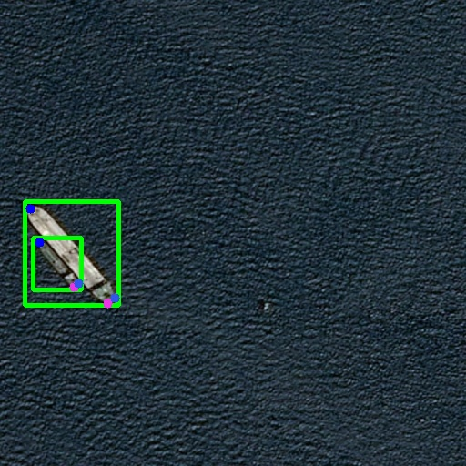
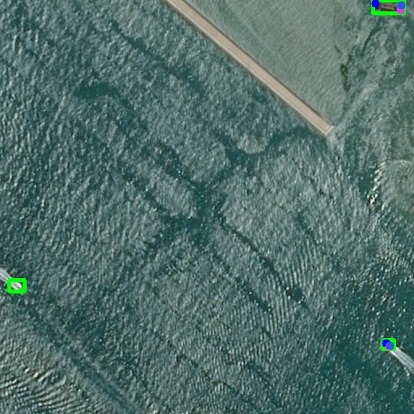
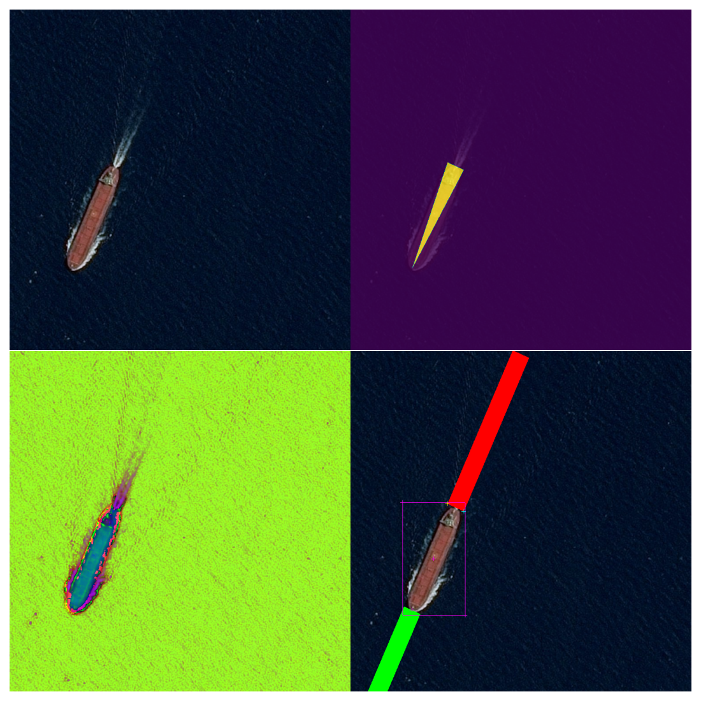
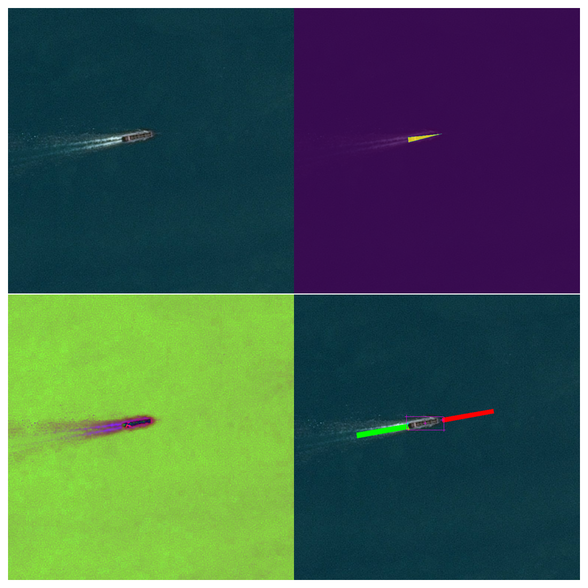
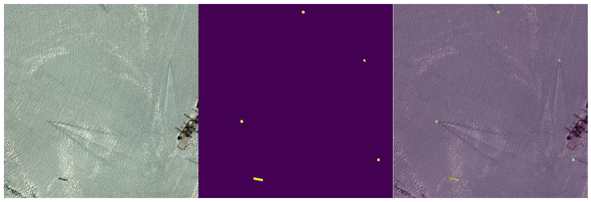

# SHIPMARK - Satellite image processing - with Airbus D&S

    

## Purpose

The Shipmark project was initially a proposal from Airbus Defence and Space. In order to complete its former "Airbus Ship Detection Challenge" competition, this project aims to
detect ships at sea to identify their position and direction. Using Machine Learning technology, this algorithm will be trained using a dataset of around 300,000 satellite images provided by Airbus.

## Method used

The idea is to identify **3 key points** on a ship to be able to **estimate the course** it's heading for and an everage of **its size**.

To achieve that we used:
*  **Python scripts:** in order to sort and format the huge amount of data.
*  **Python algorithms:** to automatically annotate satellite images for AI training.
*  **Deep Learning - Center Net model:** is our AI model that capable to detects each object as a triplet, rather than a pair, of keypoints
*  **Google Collab:** to use their GPU computing power to train our AI model
*  **Notion:** to manage project management, task allocation and teamwork

Thanks to the uge amount of data (satellite images) provided by Airbus D&S we have been able to train our model on over **50 000 images** for now. (Currently we don't have the GPU power to train it on more images)

So be aware that the results presented below show that there is considerable room for improvement, as the AI can be trained on a larger quantity of data.

As shown in the gif above each ship detected contains 4 markers:
* 🔴 **red point:** the bow of the ship
* 🔵 **blue point:** the stern left of the ship
* 🟢 **green point:** the stern right of the ship
* 🟡 **yellow rectangle:** containing a ship

## Folder Srtucture
> - The directory "AI Model" contains the deep learning CenterNet's scripts
> - The directory "scripts_python" contains scripts for measurements or for the automatic annotation algorithm

## Some result of our AI model

  

## Automatic annotation python algorithm

The initial dataset provided by airbus contained over 300,000 satellite images, so it was impossible for us to go through and sort all these images by hand.

So, by using Python programming skills we've created an algorithm able to help us by creating a first version of tags on the images

## Some result of the automatic annotation python algorithm

  

## Team of the project
 - Edouard MIGNIEN
 - Quentin MAISONNIER
 - Mathias SERICOLA
 - Clément BOUVARD
 - Ibraguim VADOUEV
 - Pierre LANGLOIS
